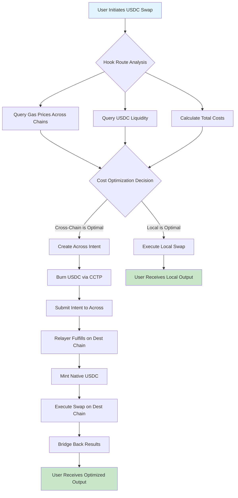
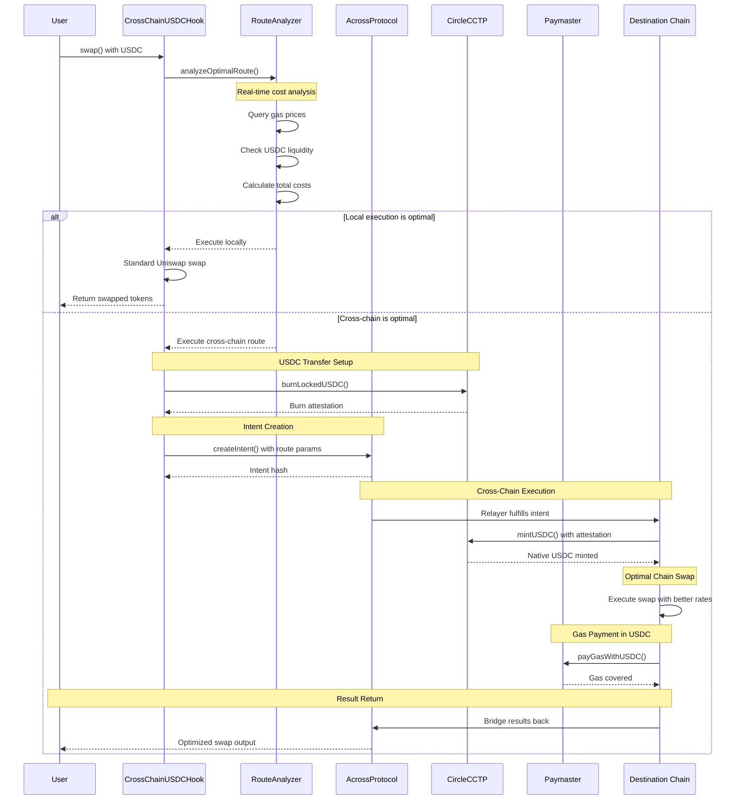

# Cross-Chain USDC Optimization Hook

## Overview

A Uniswap v4 Hook that intelligently routes USDC swaps across multiple chains using Across Protocol and Circle's CCTP v2 to minimize costs and optimize capital efficiency. This project extends UHI (Uniswap Hook Incubator) gas optimization techniques with cross-chain capabilities.

**Sponsors:** Across Protocol (VIP) + Circle (Benefactor)  
**Prize Tier:** Combined VIP + Benefactor eligibility  

## Problem Statement

Current DeFi users face several challenges when swapping USDC:

1. **Chain Fragmentation**: USDC liquidity is spread across multiple chains
2. **Cost Inefficiency**: Users pay high gas fees on expensive chains even when cheaper alternatives exist
3. **Manual Route Discovery**: No automated way to find the cheapest execution path
4. **Poor UX**: Cross-chain operations require multiple transactions and lengthy wait times
5. **Gas Token Dependencies**: Users need native tokens for gas on destination chains

## Solution Architecture

### Core Components

#### 1. Intelligent Route Discovery Hook
A Uniswap v4 Hook that analyzes swap requests and determines optimal execution paths:
- **Gas Cost Analysis**: Real-time gas price monitoring across supported chains
- **Liquidity Assessment**: Evaluates available USDC liquidity on each chain
- **Route Optimization**: Calculates total cost including bridge fees and execution costs
- **Fallback Logic**: Executes locally if cross-chain routing isn't beneficial

#### 2. Across Protocol Integration
Leverages Across V4's intent-based crosschain infrastructure:
- **Intent Creation**: Converts swap requests into crosschain intents
- **Fast Execution**: Fastest and lowest-cost way to transfer value
- **Security**: Better security tradeoffs vs. traditional bridge designs
- **ZK Proofs**: Utilizes Across V4's zero-knowledge proof system for enhanced security

#### 3. Circle CCTP v2 & Paymaster Integration
Implements Circle's advanced crosschain capabilities:
- **CCTP v2**: Advanced crosschain functionalities for faster speeds and enhanced composability
- **Native USDC**: Burns and mints native USDC instead of wrapped tokens
- **Paymaster**: Enables users to pay gas fees in USDC eliminating native token requirements
- **Account Abstraction**: ERC-4337 compliance for seamless user experience

### Technical Architecture

```
User Swap Request
       ↓
┌─────────────────┐
│  Route Analyzer │ ← Real-time gas prices
│     Hook        │ ← Liquidity data
└─────────────────┘ ← Historical patterns
       ↓
   Decision Engine
       ↓
┌─────────────────┐    ┌──────────────────┐
│  Local Swap     │ OR │  Cross-Chain     │
│  (Traditional)  │    │  Optimization    │
└─────────────────┘    └──────────────────┘
                              ↓
                    ┌──────────────────┐
                    │  Across Intent   │
                    │   + CCTP v2      │
                    └──────────────────┘
                              ↓
                    ┌──────────────────┐
                    │  Paymaster       │
                    │  (USDC Gas)      │
                    └──────────────────┘
```

## Key Features

### 1. Automatic Cost Optimization
- **Dynamic Chain Selection**: Automatically routes swaps to the most cost-effective chain
- **Gas Price Monitoring**: Real-time tracking of gas costs across all supported networks
- **Total Cost Calculation**: Includes bridge fees, execution costs, and slippage in optimization
- **Break-even Analysis**: Only routes cross-chain when savings exceed threshold

### 2. Native USDC Preservation
- **No Wrapped Tokens**: Uses Circle's CCTP v2 for native USDC transfers
- **Atomic Operations**: Ensures users receive native USDC on destination chain
- **Liquidity Efficiency**: Maintains USDC's fungibility across chains

### 3. Gasless Transactions
- **USDC Gas Payments**: Users pay gas fees in USDC instead of native tokens
- **No Native Token Requirement**: Eliminates need to hold ETH, MATIC, etc.
- **ERC-4337 Integration**: Full account abstraction support
- **Cross-Chain Gas**: USDC on one chain can pay gas on another

### 4. Enhanced UX
- **Single Transaction**: Users initiate one transaction, system handles routing
- **Intent-Based**: Users specify outcome instead of execution path
- **Fast Settlement**: Across V4's optimistic fulfillment for quick execution
- **Status Tracking**: Real-time updates on cross-chain operation progress

## Supported Chains

Initially targeting high-value chains with significant USDC activity:
- **Ethereum** (expensive, high liquidity)
- **Base** (cheap, growing ecosystem)
- **Arbitrum** (moderate cost, high activity)
- **Polygon** (very cheap, established DeFi)
- **Optimism** (moderate cost, growing)

Expandable to all chains supported by both Across V4 and Circle CCTP v2.

## Business Model & VC Appeal

### Revenue Streams
1. **Fee Sharing**: Portion of Across bridge fees for facilitated volume
2. **MEV Capture**: Route optimization creates extractable value
3. **Premium Features**: Advanced routing algorithms for institutional users
4. **Data Licensing**: Cross-chain cost analytics for other protocols

### Market Opportunity
- **Institutional Appeal**: Cost optimization directly impacts bottom line
- **Retail Adoption**: Simplified cross-chain experience drives usage
- **Infrastructure Play**: Becomes essential routing layer for multi-chain DeFi
- **Scalable**: Revenue grows with overall cross-chain volume

### Competitive Advantages
1. **First Mover**: Novel combination of Uniswap v4 hooks with intelligent routing
2. **Cost Leadership**: Demonstrable savings over manual cross-chain operations  
3. **User Experience**: Single-transaction cross-chain swaps with USDC gas payments
4. **Technical Moats**: Advanced routing algorithms and gas optimization strategies

## Technical Implementation

### Hook Architecture
```solidity
contract CrossChainUSDCOptimizer is BaseHook {
    using RouteOptimizer for PoolKey;
    using AcrossIntegration for CrossChainRoute;
    using CircleIntegration for USDCTransfer;

    struct OptimizationParams {
        uint256 gasThreshold;
        uint256 maxSlippage;
        uint256 routeTimeout;
        bool usePaymaster;
    }

    function beforeSwap(
        address sender,
        PoolKey calldata key,
        IPoolManager.SwapParams calldata params,
        bytes calldata hookData
    ) external override returns (bytes4) {
        if (_shouldOptimize(key, params)) {
            return _executeCrossChainRoute(sender, key, params, hookData);
        }
        return BaseHook.beforeSwap.selector;
    }
}
```

### Route Optimization Algorithm
1. **Cost Analysis**: Query gas prices and liquidity across all chains
2. **Route Calculation**: Model total cost for each possible execution path
3. **Benefit Assessment**: Compare cross-chain savings vs local execution
4. **Intent Creation**: Generate Across protocol intent with optimal parameters
5. **Execution Monitoring**: Track fulfillment and handle edge cases

### Circle Integration Points
- **CCTP v2 Message Passing**: For native USDC transfers
- **Paymaster Configuration**: ERC-4337 UserOperation construction  
- **Account Abstraction**: Smart contract wallet integration
- **Gas Estimation**: Accurate cross-chain gas cost prediction

## Development Roadmap

### Phase 1: Core Hook Development
- [ ] Basic route optimization logic
- [ ] Across Protocol integration
- [ ] CCTP v2 implementation
- [ ] Local testing framework

### Phase 2: Advanced Features  
- [ ] Paymaster integration
- [ ] Multi-chain gas price oracles
- [ ] Historical data analysis
- [ ] Route caching system

### Phase 3: Production Optimization
- [ ] MEV protection mechanisms
- [ ] Advanced slippage management
- [ ] Institutional API endpoints
- [ ] Analytics dashboard

### Phase 4: Ecosystem Integration
- [ ] Additional chain support
- [ ] Third-party protocol partnerships
- [ ] Yield optimization features
- [ ] Governance token launch

## Competitive Analysis

### Traditional Bridges
- **Advantage**: Automatic cost optimization vs manual bridge selection
- **Advantage**: Single transaction vs multi-step process
- **Advantage**: USDC gas payments vs native token requirements

### DEX Aggregators
- **Advantage**: Cross-chain routing vs single-chain optimization
- **Advantage**: Native USDC preservation vs wrapped token swaps
- **Advantage**: Intent-based execution vs direct transaction routing

### Existing Cross-Chain DEXs
- **Advantage**: Embedded in Uniswap v4 vs standalone application
- **Advantage**: Advanced gas optimization vs basic routing
- **Advantage**: Account abstraction integration vs EOA-only support

## Risk Analysis & Mitigation

### Technical Risks
- **Bridge Security**: Mitigated by using established protocols (Across, CCTP)
- **Gas Estimation**: Addressed through conservative estimates and fallback logic
- **Route Failure**: Handled via local execution fallback mechanisms

### Economic Risks  
- **MEV Attacks**: Protected through private mempools and intent obfuscation
- **Liquidity Fragmentation**: Monitored via real-time liquidity analysis
- **Fee Volatility**: Managed through dynamic threshold adjustments

### Operational Risks
- **Chain Outages**: Automatic failover to available chains
- **Oracle Failures**: Multiple data sources with validity checks  
- **Smart Contract Bugs**: Comprehensive testing and audit program

## Success Metrics

### Technical KPIs
- Average cost savings per transaction (target: 15-30%)
- Cross-chain execution success rate (target: >99.5%)
- Average transaction time (target: <2 minutes)
- Gas estimation accuracy (target: ±5%)

### Business KPIs
- Monthly transaction volume
- Unique user adoption rate
- Revenue per transaction
- Market share of cross-chain USDC swaps

### User Experience KPIs
- Single-transaction success rate
- User retention metrics
- Customer satisfaction scores
- Support ticket volume

## User Flow Diagrams

### Primary User Journey: Cross-Chain USDC Swap



### Detailed Hook Execution Flow



### Gas Payment Flow with Paymaster


## Project Structure

```
cross-chain-usdc-optimizer/
├── src/
│   ├── hooks/
│   │   ├── CrossChainUSDCOptimizer.sol      # Main hook contract
│   │   ├── BaseOptimizer.sol                # Abstract base with common logic
│   │   └── interfaces/
│   │       ├── IRouteOptimizer.sol          # Route analysis interface
│   │       ├── IAcrossIntegration.sol       # Across protocol interface
│   │       └── ICircleIntegration.sol       # Circle CCTP/Paymaster interface
│   │
│   ├── libraries/
│   │   ├── RouteOptimizer.sol               # Gas cost analysis & route logic
│   │   ├── AcrossIntegration.sol            # Across protocol interactions
│   │   ├── CircleIntegration.sol            # CCTP v2 & Paymaster logic
│   │   ├── GasPriceOracle.sol              # Multi-chain gas price feeds
│   │   └── USDCLiquidityAnalyzer.sol       # Liquidity assessment logic
│   │
│   ├── managers/
│   │   ├── CrossChainManager.sol            # Orchestrates cross-chain operations
│   │   ├── IntentManager.sol                # Manages Across intents lifecycle
│   │   └── PaymasterManager.sol             # ERC-4337 UserOperation handling
│   │
│   ├── oracles/
│   │   ├── ChainlinkGasPriceOracle.sol     # Chainlink gas price feeds
│   │   ├── MultiChainOracle.sol            # Aggregated multi-chain data
│   │   └── LiquidityOracle.sol             # USDC liquidity across chains
│   │
│   ├── storage/
│   │   ├── RouteStorage.sol                # Route optimization parameters
│   │   ├── ChainConfig.sol                 # Chain-specific configurations
│   │   └── FeeStorage.sol                  # Fee structures and thresholds
│   │
│   └── utils/
│       ├── Constants.sol                   # Chain IDs, addresses, constants
│       ├── Errors.sol                      # Custom error definitions
│       └── Events.sol                      # Event definitions
│
├── test/
│   ├── unit/
│   │   ├── CrossChainUSDCOptimizer.t.sol   # Main hook unit tests
│   │   ├── RouteOptimizer.t.sol            # Route analysis tests
│   │   ├── AcrossIntegration.t.sol         # Across integration tests
│   │   └── CircleIntegration.t.sol         # Circle integration tests
│   │
│   ├── integration/
│   │   ├── E2E.t.sol                       # End-to-end cross-chain tests
│   │   ├── GasOptimization.t.sol           # Gas cost validation tests
│   │   └── PaymasterFlow.t.sol             # Paymaster integration tests
│   │
│   ├── fork/
│   │   ├── MainnetFork.t.sol               # Mainnet fork tests
│   │   ├── ArbitrumFork.t.sol              # Arbitrum fork tests
│   │   └── BaseFork.t.sol                  # Base fork tests
│   │
│   ├── mocks/
│   │   ├── MockAcrossProtocol.sol          # Across protocol mock
│   │   ├── MockCircleCCTP.sol              # Circle CCTP mock
│   │   ├── MockPaymaster.sol               # Paymaster mock
│   │   └── MockOracles.sol                 # Oracle mocks
│   │
│   └── helpers/
│       ├── TestHelpers.sol                 # Common test utilities
│       ├── ChainHelpers.sol                # Multi-chain test setup
│       └── USDCHelpers.sol                 # USDC-specific test utils
│
├── script/
│   ├── Deploy.s.sol                        # Main deployment script
│   ├── ConfigureChains.s.sol               # Multi-chain configuration
│   ├── SetupOracles.s.sol                  # Oracle configuration
│   └── VerifyContracts.s.sol               # Contract verification
│
├── lib/                                    # Foundry dependencies
├── broadcast/                              # Deployment artifacts
├── cache/                                  # Foundry cache
├── out/                                    # Compiled contracts
├── .env.example                            # Environment template
├── foundry.toml                            # Foundry configuration
└── remappings.txt                          # Import remappings
```

## Core Components

### 1. CrossChainUSDCOptimizer.sol (Main Hook)
**Purpose**: The primary Uniswap v4 hook that intercepts USDC swaps and determines optimal execution paths.

**Key Functions**:
- `beforeSwap()`: Analyzes swap parameters and routes optimization
- `afterSwap()`: Handles post-swap cleanup and result processing
- `_shouldOptimize()`: Decision logic for local vs cross-chain execution
- `_executeCrossChainRoute()`: Orchestrates cross-chain swap execution

### 2. RouteOptimizer.sol (Core Logic Library)
**Purpose**: Contains the intelligent routing algorithms and cost analysis logic.

**Key Functions**:
- `analyzeOptimalRoute()`: Determines best execution chain
- `calculateTotalCost()`: Models complete transaction costs
- `getGasPrices()`: Fetches real-time gas prices across chains
- `assessLiquidity()`: Evaluates USDC liquidity depth

### 3. AcrossIntegration.sol (Cross-Chain Bridge)
**Purpose**: Handles all interactions with Across Protocol for cross-chain transfers.

**Key Functions**:
- `createIntent()`: Creates cross-chain transfer intents
- `fulfillIntent()`: Handles intent fulfillment on destination chains
- `trackIntentStatus()`: Monitors cross-chain operation progress
- `handleFailedIntent()`: Fallback logic for failed transfers

### 4. CircleIntegration.sol (USDC Native Transfers)
**Purpose**: Manages Circle's CCTP v2 for native USDC transfers and Paymaster integration.

**Key Functions**:
- `burnAndMint()`: CCTP v2 native USDC cross-chain transfers
- `constructUserOp()`: ERC-4337 UserOperation for Paymaster
- `payGasWithUSDC()`: Gas payment in USDC tokens
- `validatePaymasterData()`: Paymaster signature validation

### 5. CrossChainManager.sol (Orchestration)
**Purpose**: High-level coordinator for complex cross-chain operations.

**Key Functions**:
- `orchestrateSwap()`: Main coordination logic
- `handleChainFailure()`: Chain-specific error handling
- `updateChainStatus()`: Monitor chain health and availability
- `rebalanceProtocol()`: Protocol-level optimization adjustments

## Dependencies

### Foundry Libraries (lib/)

```toml
[dependencies]
# Uniswap v4 Core
v4-core = { git = "https://github.com/Uniswap/v4-core", tag = "v0.0.1-alpha" }
v4-periphery = { git = "https://github.com/Uniswap/v4-periphery", tag = "v0.0.1-alpha" }

# OpenZeppelin Contracts
openzeppelin-contracts = { git = "https://github.com/OpenZeppelin/openzeppelin-contracts", tag = "v4.9.0" }
openzeppelin-contracts-upgradeable = { git = "https://github.com/OpenZeppelin/openzeppelin-contracts-upgradeable", tag = "v4.9.0" }

# Account Abstraction (ERC-4337)
account-abstraction = { git = "https://github.com/eth-infinitism/account-abstraction", tag = "v0.7.0" }

# Across Protocol Contracts
across-protocol = { git = "https://github.com/across-protocol/contracts", tag = "v3.0.0" }

# Circle CCTP Contracts  
circle-cctp = { git = "https://github.com/circlefin/evm-cctp-contracts", tag = "v1.0.0" }

# Chainlink Contracts
chainlink = { git = "https://github.com/smartcontractkit/chainlink", tag = "v2.0.0" }

# Forge Standard Library
forge-std = { git = "https://github.com/foundry-rs/forge-std", tag = "v1.7.0" }

# Solmate (Gas-optimized contracts)
solmate = { git = "https://github.com/transmissions11/solmate", tag = "v6" }
```

### External Protocol Dependencies

**Across Protocol V4**:
- `SpokePool.sol` - Cross-chain intent creation and fulfillment
- `HubPool.sol` - Main coordination contract on mainnet  
- `AcrossConfigStore.sol` - Protocol configuration management

**Circle Integrations**:
- `TokenMessenger.sol` - CCTP v2 message passing
- `MessageTransmitter.sol` - Cross-chain message verification
- `CirclePaymaster.sol` - ERC-4337 paymaster implementation
- `USDC.sol` - Native USDC token contracts

**Uniswap v4**:
- `PoolManager.sol` - Core pool management
- `BaseHook.sol` - Hook base contract
- `Hooks.sol` - Hook permission management
- `Currency.sol` - Multi-token support

**Chainlink Oracles**:
- `AggregatorV3Interface.sol` - Gas price feed interface
- `FeedRegistry.sol` - Multi-asset price feeds

### Configuration Files

**foundry.toml**:
```toml
[profile.default]
src = "src"
out = "out"
libs = ["lib"]
test = "test"
cache_path = "cache"

# Optimizer settings
optimizer = true
optimizer_runs = 1000000

# Multi-chain RPC configuration
[rpc_endpoints]
mainnet = "${MAINNET_RPC_URL}"
arbitrum = "${ARBITRUM_RPC_URL}"
base = "${BASE_RPC_URL}"
polygon = "${POLYGON_RPC_URL}"
optimism = "${OPTIMISM_RPC_URL}"

# Chain-specific settings
[etherscan]
mainnet = { key = "${ETHERSCAN_API_KEY}" }
arbitrum = { key = "${ARBISCAN_API_KEY}" }
base = { key = "${BASESCAN_API_KEY}" }
```

**remappings.txt**:
```
@uniswap/v4-core/=lib/v4-core/
@uniswap/v4-periphery/=lib/v4-periphery/
@openzeppelin/contracts/=lib/openzeppelin-contracts/contracts/
@account-abstraction/=lib/account-abstraction/contracts/
@across-protocol/=lib/across-protocol/contracts/
@circle-cctp/=lib/circle-cctp/src/
@chainlink/=lib/chainlink/contracts/
forge-std/=lib/forge-std/src/
solmate/=lib/solmate/src/
```

## Getting Started

### Prerequisites
- **Foundry** (latest version)
- **Node.js** 18+ (for additional tooling)
- **Git** for dependency management
- **Multi-chain RPC endpoints** (Alchemy, Infura, etc.)

### Installation
```bash
git clone https://github.com/your-org/cross-chain-usdc-optimizer
cd cross-chain-usdc-optimizer

# Install Foundry dependencies
forge install

# Build contracts
forge build

# Run tests
forge test
```

### Multi-Chain Testing
```bash
# Fork testing on different chains
forge test --fork-url $MAINNET_RPC_URL --match-contract MainnetFork
forge test --fork-url $ARBITRUM_RPC_URL --match-contract ArbitrumFork
forge test --fork-url $BASE_RPC_URL --match-contract BaseFork

# Gas optimization analysis
forge test --gas-report --match-contract GasOptimization

# Integration tests with live protocols
forge test --match-contract E2E --fork-url $MAINNET_RPC_URL
```

## Contributing

We welcome contributions! Please see our [Contributing Guide](CONTRIBUTING.md) for details on:
- Code standards
- Testing requirements  
- Documentation expectations
- Pull request process

## License

MIT License - see [LICENSE](LICENSE) for details.

## Contact

- **Team**: [Your Team Name]
- **Discord**: @your-discord
- **Email**: team@your-domain.com
- **Twitter**: @your-project

---

*This project is submitted for the Uniswap v4 Hookathon, targeting Across Protocol (VIP) and Circle (Benefactor) sponsor prizes.*
